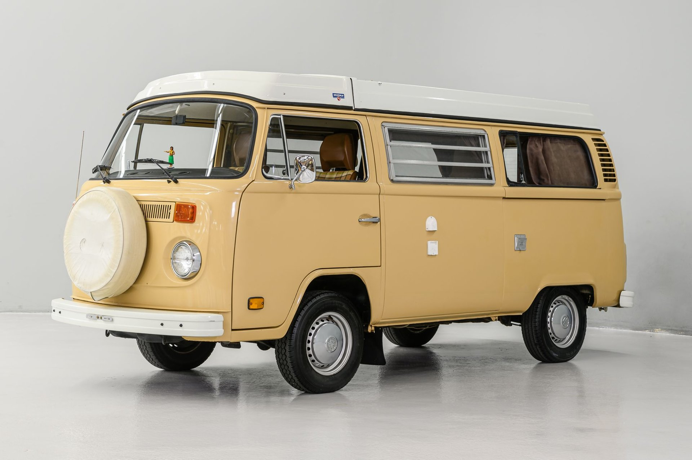

## Hi there I'm Jorge Arteaga👋
I'm currently working on a Internet and Web Development Bachelor of Applied Science degree at Arizona State University.

I am working as a Graphic Designer in higher education and would like to expand my skill set to include web development, so I may have more knowledge and control of how my visual contributions are applied through web content.

A fun fact about me is that I drove up the PCH in one of these on a road trip from Tucson, Arizona to Portland, Orgeon and had a blast!

<!--
**jarteag1/jarteag1** is a ✨ _special_ ✨ repository because its `README.md` (this file) appears on your GitHub profile.

Here are some ideas to get you started:

- 🔭 I’m currently working on ...
- 🌱 I’m currently learning ...
- 👯 I’m looking to collaborate on ...
- 🤔 I’m looking for help with ...
- 💬 Ask me about ...
- 📫 How to reach me: ...
- 😄 Pronouns: ...
- ⚡ Fun fact: ...
-->
